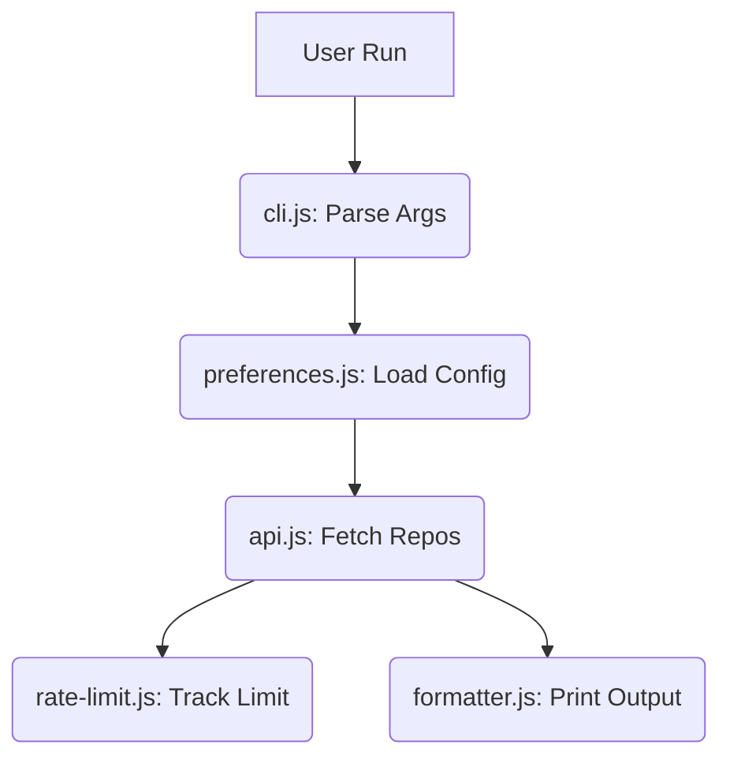

# GitHub Trending CLI

Discover trending GitHub repositories directly from terminal.

## Overview
* **Problem Solved**: Avoids manual browser searches to find trending code repositories.
* **Target Audience**: Developers, open-source maintainers, and code reviewers.
* **Key Capabilities**: Filter by dates, languages, stars. Remembers previous preferences.

## Features
* **Smart Filtering**: Match repos by language, creation date range, and star counts.
* **Automatic Backoff**: Retries requests when GitHub rate limits are encountered.
* **Local Preferences**: Stores last used configurations to speed up subsequent queries.
* **Token Support**: Accepts GitHub Personal Access Tokens (PATs) for higher limits.

## Tech Stack
* **Runtime**: Node.js (Version >= 12)
* **Packaging**: Docker (Lightweight Alpine Linux Node image)
* **Libraries**: Native Node `https` and `readline` modules (no dependencies)

## Architecture

Standard flow diagram:



### Flow Details
1. **Inputs**: Command arguments are parsed and merged with stored properties.
2. **Interactive prompt**: Triggered if preferences do not exist yet.
3. **Execution**: Builds query, runs API request, parses limits, and prints results.

## Folder Structure

* **`bin/`**: Contains main script wrapper.
  * [index.js](file:///d:/Projects/GitCliTrending/bin/index.js) — Tool entry point.
* **`src/`**: Engine core modules.
  * [api.js](file:///d:/Projects/GitCliTrending/src/api.js) — Network requests and retries.
  * [cli.js](file:///d:/Projects/GitCliTrending/src/cli.js) — Configuration merging and validators.
  * [config.js](file:///d:/Projects/GitCliTrending/src/config.js) — Application parameters.
  * [formatter.js](file:///d:/Projects/GitCliTrending/src/formatter.js) — Text layouts and colors.
  * [preferences.js](file:///d:/Projects/GitCliTrending/src/preferences.js) — Reads/writes persistent settings.
  * [prompts.js](file:///d:/Projects/GitCliTrending/src/prompts.js) — Terminal setup wizard.
  * [rate-limit.js](file:///d:/Projects/GitCliTrending/src/rate-limit.js) — Tracks limit headers.

---

## Usage Guide

### Using Docker (Recommended)

Run instant container:
```bash
docker run --rm gitclitrending
```

Custom flags:
```bash
docker run --rm gitclitrending --duration month --language javascript --limit 20
```

### Local Setup

Install packages:
```bash
npm install
```

Start wizard:
```bash
npm start
```

Run with arguments:
```bash
npm start -- --duration week --limit 15 --language go
```

## Options

| Parameter | Allowed Values | Default | Example |
| :--- | :--- | :--- | :--- |
| `--duration` | `day`, `week`, `month`, `year` | `week` | `--duration month` |
| `--limit` | `1` to `100` | `10` | `--limit 25` |
| `--language` | Language string | None | `--language python` |
| `--min-stars`| Minimum stars | `0` | `--min-stars 500` |
| `--token` | GitHub Personal Token | None | `--token ghp_xxxx` |
| `--reset-prefs`| Reset preferences | `false` | `--reset-prefs` |
| `--help` | Show command helper | - | `--help` |
